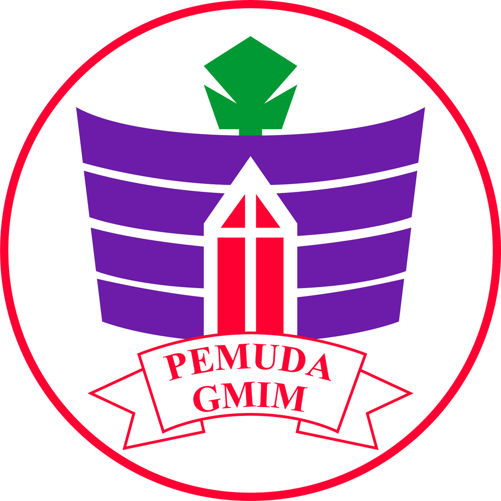
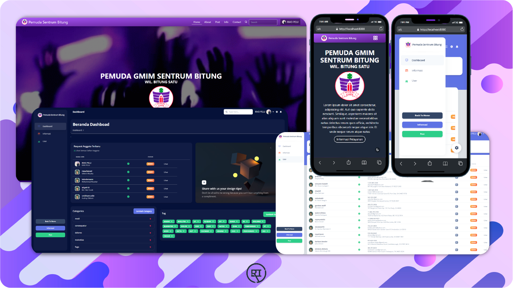
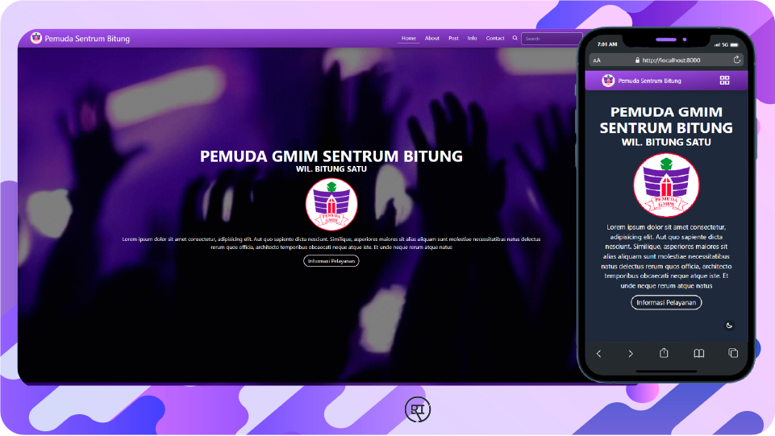
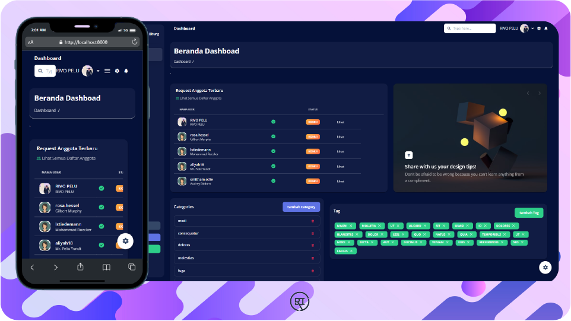

<h1 align="center">PEMUDA SENTRUM WEB APP</h1>

  <h1 align="center">
    
     
    
    
     
  </h1>

##  LATAR BELAKANG

Web App pemuda sentrum  bitung di bangun  dengan  tujuan  untuk  mempermudah  dalam  pengolahan data anggota, menyalurkan  informasi yang lengkap  dengan  dokumentasi yang lengkap  dengan  ui yang menarik, sensus  anggota, dan lain sebagainya  untuk  membantu  komisi pemuda sentrum  bitung. 
 
 
 
  ##  **DASAR PENGEMBANGAN** 

Web app ini di bangun dan di kembangkan  dengan  bahasa  pemograman  <a href="https://www.php.net/">**PHP**</a>
 dan dengan Framework <a href="https://iconscout.com/unicons">**Laravel 9**</a>
 dengan  berbagai assets, API, yang di gunakan 

 

##  **FRONTEND** 

Frontend web App sedang  dalam  pengembangan  sekitar 25% yang telah  selesai dan di bangun  dengan UI menggunakan framework CSS yaitu tailwind css dan dengan  aset-aset yang di gunakan  sebagai  berikut 

-   UI Framework - <a href="https://tailwindcss.com/">Tailwind CSS  V3.0.23</a>

-   Icon Assets -  <a href="https://iconscout.com/unicons">Unicons Icons</a>

-   Swiper Carrosel - <a href="https://swiperjs.com/">Swiper Bundle</a> 

Dan kemungkinan  dari  pengambangan  kedepan asset-asset dalam  tersebut  bisa  saja  bertambah 
 
 
 
## BACKEND / DASHBOARD

Backend webapp sepenuhnya di bangun  dengan  bahasa  Pemograman PHP dengan  FrameWork  LARAVEL untuk  tahap  penganbangan Backend juga menggunakan  beberapa asset yang di gunakan dan untuk UI dashboard menggunakan  Argon dashboard yang berbasis  <a href="https://getbootstrap.com/">Bootsrap v5.0 </a>.

 

Asset-asset yang di gunakan  dalam  pengembangan Backend WebApp pemuda Sentrum  bitung  sebagai  berikut :

-   UI Framework --   <a href="https://getbootstrap.com/">Bootsrap v5.0 </a>

-   Dashboard Template -- <a href="https://www.creative-tim.com/product/argon-dashboard">Argon dashboard </a>

-   Font API -- 
<a href="https://fonts.google.com/">Google Font API </a>

-   Icon Asset -- <a href="https://fontawesome.com/">Font Awesome V5.15.4 </a>

-   Text Editor -- <a href="https://ckeditor.com/ckeditor-5/">CK Editor V5.0 </a>

-   Multiple input --  <a href="https://select2.org/">Select-2 V4.1.0 </a>

Dan dalam  pengembangan  kemungkinan  akan  tetap  bertambah, untuk  sekarang  Pengembangan Backend sudah  mencapai  sekitar 70% tahap  pengembangan  sebelum  masuk  ke  dalam  Pengembangan Frontend